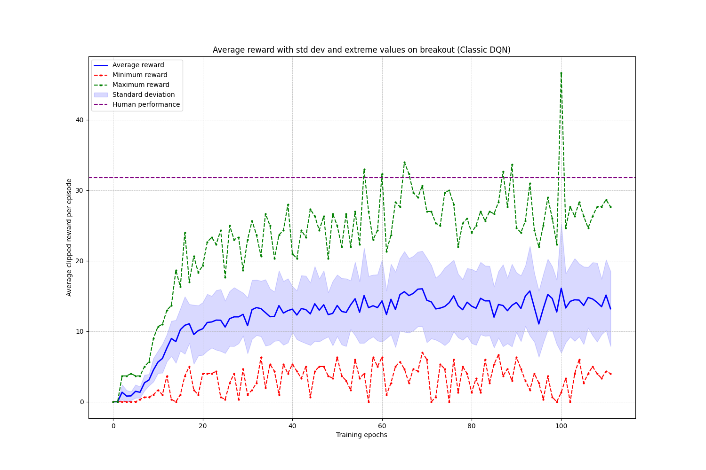
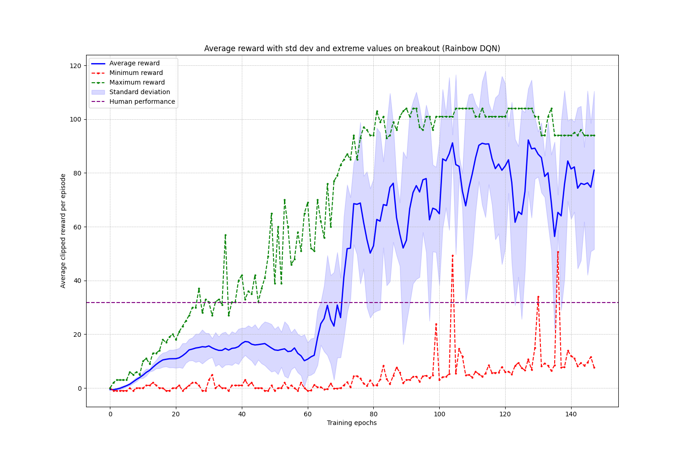

# Classic / Rainbow DQN implementation for Atari Breakout

This repository contains a PyTorch implementation of Rainbow DQN for Atari games, with a focus on Breakout. The implementation combines several key improvements to the original DQN algorithm proposed by the Rainbow DQN paper to achieve a better performance.

https://github.com/user-attachments/assets/b8180e58-7f20-4650-8148-2060d174038c

## Performance results

After training for 5M steps on an RTX 3070Ti GPU (and 16Go RAM), my implementation achieves the following clipped reward results on Breakout:

| Agent | Mean Score | Std Dev | Min | Max |
|-------|------------|---------|-----|-----|
| Random Agent | 1.364 | 1.394 | 0.0 | 7.0 |
| Human Baseline | 31.8 | - | - | - |
| Classic DQN | 14.211 | 5.852 | 0.0 | 28.0 |
| Rainbow DQN | 70.242 | 32.931 | 8.0 | 105.0 |

The maximal possible reward is 108 (game with 6*18=108 bricks).

### Training progress (Classic DQN ~10 hours)

<p align="center">
  
  <br>
  <em>Classic DQN learning curve (each epoch represent 50,000 batches)</em>
</p>

### Training progress (Rainbow DQN ~14 hours)

<p align="center">
  
  <br>
  <em>Rainbow DQN learning curve (each epoch represent 50,000 batches)</em>
</p>

## Key features

### 1. Environment preprocessing (AtariPreprocessing)
- Frame resizing to 84×84
- Grayscale conversion
- Frame stacking (4 frames)
- Action repeat (4 frames)
- Reward clipping between -1 and 1

### 2. Rainbow DQN components
- **Double Q-Learning**: Reduces overestimation of Q-values
- **Dueling network**: Separate streams for state value and action advantages
- **Noisy networks**: Parameter space noise for exploration
- **Prioritized experience replay**: Prioritizes important transitions

### 3. Classic network architecture
```
Conv2D(4→16, kernel=4, stride=2)
Conv2D(16→32, kernel=4, stride=2)
    ↓
Linear layers
```
See: classic_dqn/dqn.py

### 4. Rainbow network architecture
```
Conv2D(4→32, kernel=8, stride=4)
Conv2D(32→64, kernel=4, stride=2)
Conv2D(64→64, kernel=3, stride=1)
    ↓
Split into Value/Advantage Streams
    ↓
NoisyLinear layers for exploration
```
See: rainbow_dqn/DuelingDQN_model.py

## Usage

### Training
```bash
cd rainbow_dqn
python main.py train [options]

# Training options:
--learning-rate             Learning rate (default: 0.0000625)
--gamma                     Discount factor (default: 0.99)
--batch-size                Batch size (default: 32)
--memory-size               Replay buffer size (default: 100000)
--episodes                  Number of episodes (default: 500000)
--replay-start-size         Replay size before training start (default: 80000)
--target-update-frequency   Target network update frequency (default: 5000)
--continue-training         Continue from saved model (default: False)
```

### Evaluation
```bash
cd rainbow_dqn
python main.py play --model-path=<path_to_model>
```

Here, you can directly try this:
```bash
cd rainbow_dqn
python main.py play --model-path=saved_models/breakout_5M_steps_rainbow_dqn
```


# Hyperparameters for Atari Breakout

| **Hyperparameter**                      | **Classic DQN**  | **Rainbow DQN**  |
| --------------------------------------- | ---------------- | ---------------- |
| **Learning rate**                       | 0.0001           | 0.0000625        |
| **Discount factor (γ)**                 | 0.99             | 0.99             |
| **Replay memory size**                  | 100,000          | 100,000          |
| **Batch size**                          | 32               | 32               |
| **Target update frequency**             | 5,000            | 5,000            |
| **Frame skip**                          | 4                | 4                |
| **Min epsilon**                         | 0.1              | N/A              |
| **Max epsilon**                         | 1.0              | N/A              |
| **Epsilon decay steps**                 | 4M (steps)       | N/A              |
| **Max steps**                           | 4,5M             | 8M               |
| **Replay start size**                   | 32               | 80,000           |
| **Save frequency**                      | 50,000           | 50,000           |
| **Noisy nets std init**                | N/A              | 0.5              |
| **PER alpha (α)**                      | N/A              | 0.6              |
| **PER beta start (β)**                 | N/A              | 0.4              |
| **Reward clipping**                    | [-1, 1]          | [-1, 1]          |
| **Input frame stack**                  | 4                | 4                |           |

## References for the classic DQN model / agent

1. [Playing Atari with Deep Reinforcement Learning](https://arxiv.org/pdf/1312.5602)

## References for the rainbow DQN model / agent

1. [Deep Reinforcement Learning with Double Q-learning](https://arxiv.org/pdf/1509.06461)
2. [Dueling Network Architectures for Deep Reinforcement Learning](https://arxiv.org/pdf/1511.06581)
3. [Noisy Networks for Exploration](https://arxiv.org/pdf/1706.10295)
4. [Prioritized Experience Replay](https://arxiv.org/pdf/1511.05952)
5. [Rainbow: Combining Improvements in Deep Reinforcement Learning](https://arxiv.org/pdf/1710.02298)
